# Лабораторная работа  №3

### Задание
Написать программу генерации монохромной BMP-картинки на основе вашего варианта.

**Вход программы:**
* Вариант 0: 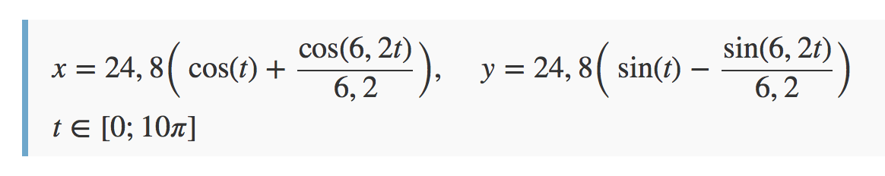
* Вариант 1: 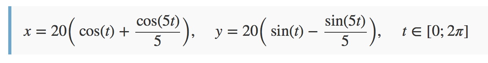
* Вариант 2: 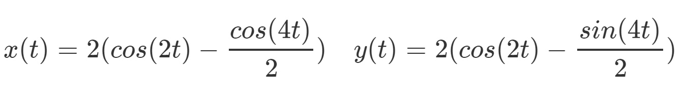
* Вариант 3: 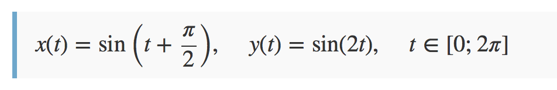
* Вариант 4: 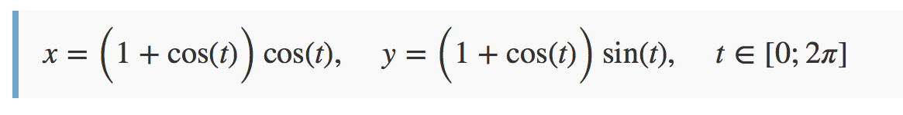
* Вариант 5: 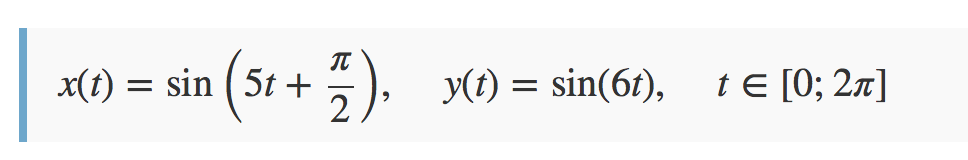
* Вариант 6: 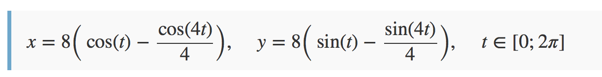
* Вариант 7: 
* Вариант 8: 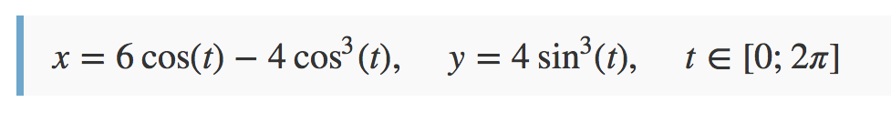
* Вариант 9: 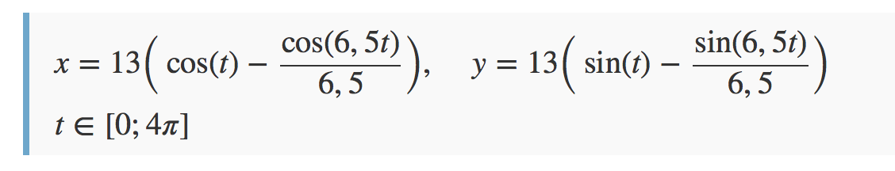
* Вариант 10: 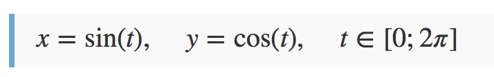
* Вариант 11: 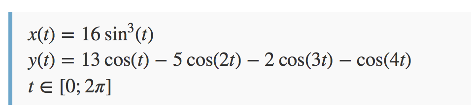
* Вариант 12: 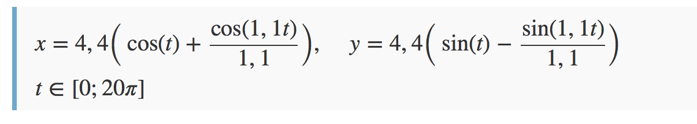
* Вариант 13: 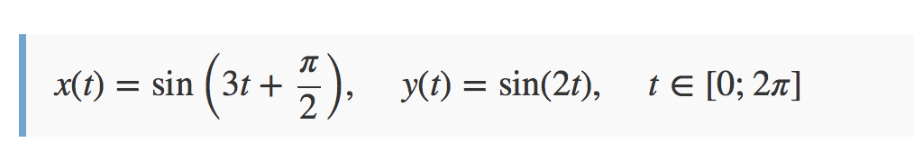
* Вариант 14: 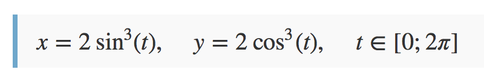
* Вариант 15: 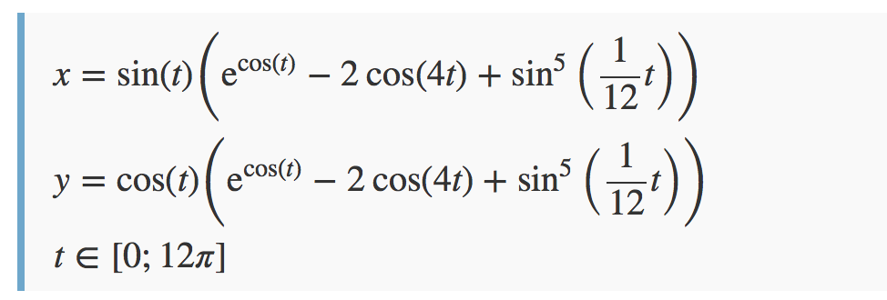
* Вариант 16: 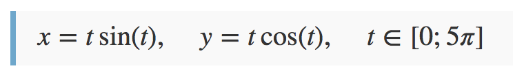
* Вариант 17: 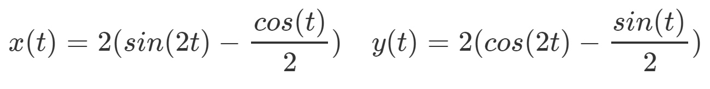

**Соответствие варианта и фамилии**
Студент 3181| Студент 3180 |Вариант
-------------|-------------|--------
Балданов Цыденжап Баирович	|	Бецкова Елизавета Сергеевна	|	Вариант 0
Бойцов Михаил Павлович	|	Верзаков Александр Юрьевич	|	Вариант 1
Дулькин Илья Сергеевич	|	Ганай Анна Евгеньевна	|	Вариант 2
Есаулов Лев Павлович	|	Зайцева Юлия Игоревна	|	Вариант 3
Железко Игорь Геннадьевич	|	Захарова Екатерина Сергеевна	|	Вариант 4
Захаров Ярослав Кириллович	|	Калинкин Михаил Александрович	|	Вариант 5
Златоустов Алексей Витальевич	|	Константинова Софья Сергеевна	|	Вариант 6
Карагаев Валерий Юрьевич	|	Лазарев Кирилл Александрович	|	Вариант 7
Кисель Никита Сергеевич	|	Лядышева Екатерина Юрьевна	|	Вариант 8
Ле Чонг Минь	|	Протопопов Артём Андреевич	|	Вариант 9
Мохов Илья Витальевич	|	Прохоров Алексей Игоревич	|	Вариант 10
Олейник Александр Витальевич	|	Растворцева Арина Евгеньевна	|	Вариант 11
Пашков Тимофей Николаевич	|	Рюмкина Дарья Андреевна	|	Вариант 12
Пеева Софья Павловна	|	Савельев Александр Олегович	|	Вариант 13
Танер Бахадыр Джан	|	Самсонов Станислав	|	Вариант 14
Титова Екатерина Витальевна	|	Сорокина Анастасия Дмитриевна	|	Вариант 15
Ширяев Антон Сергеевич	|	Черных Артём Сергеевич	|	Вариант 16
Штарьков Роман Вячеславович	|		|	Вариант 17

**Выход программы:**
BMP-файл

### Дополнительные материалы
* Описание формата [BMP](https://ru.wikipedia.org/wiki/BMP)
* Еще о [BMP](https://medium.com/sysf/bits-to-bitmaps-a-simple-walkthrough-of-bmp-image-format-765dc6857393)
* Может пригодиться модуль [struct](https://docs.python.org/3/library/struct.html)

> **_ВАЖНО:_**
Результат оформить в виде репозитория на гитхабе.